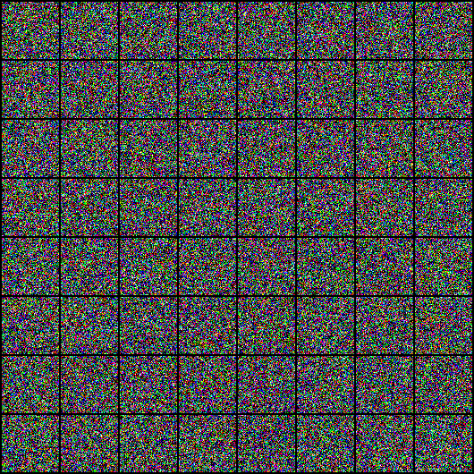
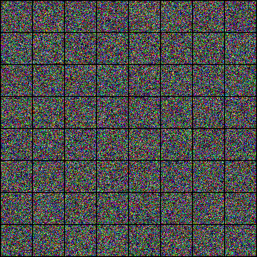

# Pokemon-Diffusion
This is a project for the course Deep Generative Diffusion Models where the goal was to implement an end-to-end diffusion model for generation of pokemon images.

There are two implementations in Pytorch. One is a simple DDPM implementation and the other is a Classifier Free-Guidance (CFG) Based class (pokemon type) conditional generation implemented as bonus part(idea taken from [Classifier-Free Diffusion Guidance](https://arxiv.org/abs/2207.12598)). Hence there are two (.py) files. 

To run the script simply select which file you want to run in ```script.sh``` in a GPU environment. 

Also, I have added a google colab notebook (.ipynb) that includes both these implementations and describes everything step-by-step. Please, just refer to the notebook in case you have any doubts about the implementation. Steps to automatically download the data and arrange them in the required directory can be found in the notebook. The notebook also downloads the model checkpoints if want to evaluate the results. This can be done by setting the **Train** flag False.

Note: Running the implementation on colab will be really slow.

The results of DDPM 



The results of conditional diffusion model conditioned on the pokemon type based on the classifier free guidance approach



